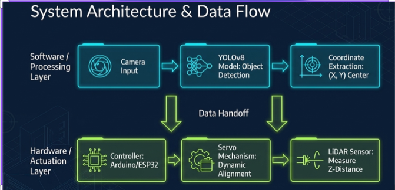
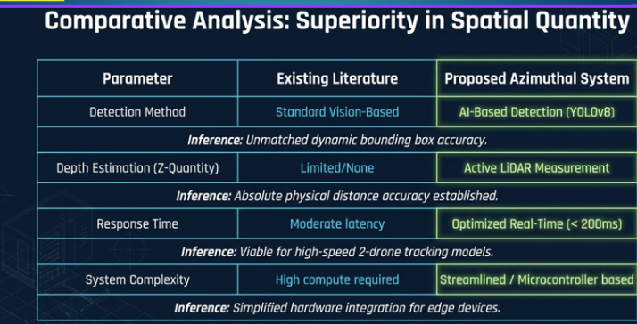
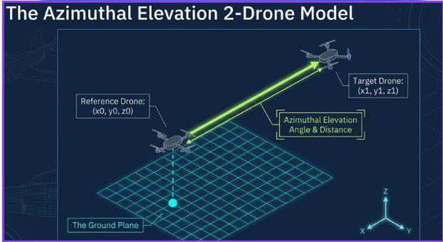
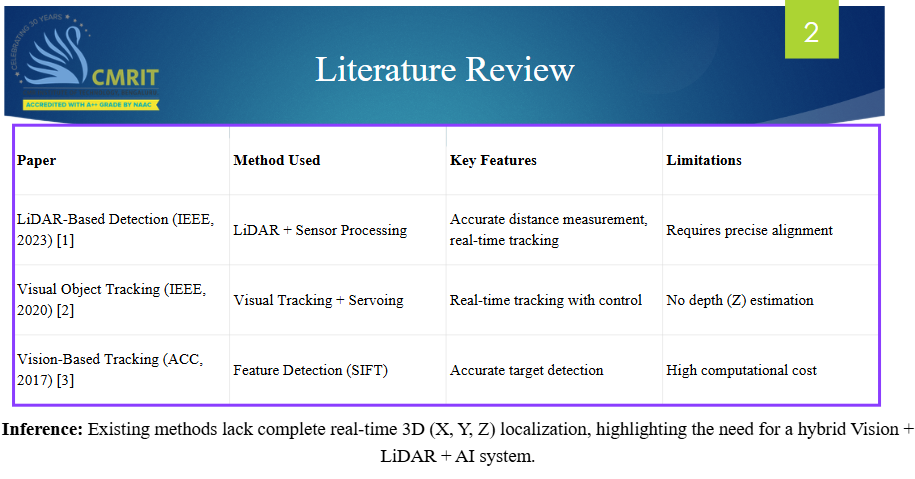

# AI-Based UAV Tracking and Depth Estimation System 🚁

## Project Codename: Novocaine

An AI-powered UAV tracking and depth estimation platform designed for real-time aerial surveillance, autonomous target tracking, and edge-based processing using computer vision and LiDAR integration.

---

# 🚀 Overview

Novocaine is a next-generation UAV intelligence system capable of:

- Real-time object detection
- AI-based target tracking
- Depth estimation using LiDAR
- Live telemetry visualization
- Edge AI processing for low-latency response

The project combines AI, embedded systems, and computer vision into a unified defense-oriented surveillance platform.

---

# 🖥️ Dashboard Preview


---

# 🎯 Core Features

- Real-time UAV/Object Detection using YOLOv8
- Depth Estimation via LiDAR
- X, Y, Z Coordinate Tracking
- Edge Processing & Onboard Inference
- Live Telemetry Dashboard
- AI Analytics & Detection History
- System Health Monitoring
- UAV Surveillance Interface

---

# 🧠 System Architecture



---

# 📊 Comparative Analysis



---

# 📡 Tracking & Detection Model



---

# 📚 Literature Review



---

# ⚙️ Working Pipeline

1. Camera captures live video feed
2. YOLOv8 performs object detection
3. LiDAR calculates object distance
4. System computes X, Y, Z coordinates
5. Backend processes telemetry data
6. Frontend visualizes live UAV tracking data
7. Edge processing reduces latency and improves response speed

---

# 🧩 Tech Stack

## Frontend
- React
- Vite
- TailwindCSS
- Framer Motion

## Backend
- Python
- Flask
- OpenCV

## AI & Detection
- YOLOv8
- Ultralytics

## Hardware
- ESP32
- LiDAR Sensor
- Camera Module
- Servo System

---

# 📂 Project Structure

```bash
Novocaine/
│
├── Backend/                 # Flask backend & APIs
│   └── app.py
│
├── Frontend/
│   └── nova-ui/             # React frontend dashboard
│
├── assets/
│   └── images/              # README images & visuals
│
├── docs/                    # PPTs & documentation
├── research/                # Research references
├── train.py                 # Detection training/testing
│
├── README.md
└── requirements.txt